# ELITE AUTONOMOUS MULTI-AGENT AI SOFTWARE ENGINEERING PLATFORM
## Enterprise Architecture Blueprint

---

## 1. Executive Vision
The future of software engineering is not merely AI-assisted; it is **AI-autonomous**. This blueprint outlines an enterprise-grade, distributed multi-agent AI platform capable of operating as an elite software engineering organization. This platform ingests, comprehends, safely refactors, optimizes, and governs mission-critical codebases at scale. It guarantees strict business intent preservation, zero-regression deployments, and continuous system self-improvement, operating on par with Principal Engineers from FAANG organizations.

## 2. Enterprise System Overview
The system acts as a decentralized brain for the enterprise. It is composed of highly specialized, loosely coupled AI agents operating over a unified Engineering Knowledge Graph. The system constantly monitors production telemetry to close the feedback loop between code generation and runtime performance. It is governed by a strict Validation Governance Layer that enforces semantic equivalence, security compliance, and architectural boundaries.

## 3. Full Architecture Blueprint
The platform is layered into a unified cohesive system:
1.  **Master Orchestration Layer**: The central brain, routing tasks and managing distributed consensus.
2.  **Agent Coordination Layer**: Sub-system orchestrators managing specialized teams of agents.
3.  **Runtime & Production Layer**: Real-time telemetry ingestion and anomaly detection.
4.  **Architecture & Security Intelligence**: Static/dynamic analysis, threat modeling, and boundary enforcement.
5.  **Execution & Governance**: Safe refactoring, semantic validation, and deployment pipelines.

## 4. Multi-Agent Hierarchy
The hierarchy follows an organizational structure:
- **Level 0: The Executive Brain** (Master Orchestrator, AI Model Router)
- **Level 1: Domain Architects** (Architecture Audit, Security Audit, Data Optimization, DevOps Governance)
- **Level 2: Execution Specialists** (Refactoring, Context Understanding, QA Automation, Infrastructure)
- **Level 3: Runtime Intelligence** (Production Telemetry, Observability, Self-Healing)

## 5. Agent-by-Agent Detailed Specifications
*   **Master Orchestrator Agent**: Routes tasks, resolves inter-agent conflicts, manages global state.
*   **Context Understanding Agent**: Parses ASTs, builds dependency graphs, summarizes module behavior.
*   **Business Intent Preservation Agent**: Enforces invariants, detects semantic regressions.

*   **Refactoring Agent**: Executes precise code modifications using safe, AST-aware transformations.
*   **Semantic Validation Agent**: Validates state transitions and logic using execution replay.
*   **Security Audit Agent**: Runs dynamic and static application security testing (DAST/SAST).
*   **API Governance Agent**: Enforces backward compatibility, REST/GraphQL standards.
*   **Database Optimization Agent**: Analyzes slow queries, suggests indexes, plans sharding.
*   **Production Intelligence Agent**: Ingests OpenTelemetry data to find live bottlenecks.
*   **Technical Debt Intelligence Agent**: Scores code complexity and plans incremental rewrites.
*   *(Includes all 30 specified agents functioning via RPC and Graph Memory synchronization).*

## 6. Orchestration Layer Design
A distributed event-bus architecture (e.g., Kafka/Temporal) manages agent lifecycles. It uses a Saga pattern for complex refactoring workflows, ensuring that if validation fails, the entire refactoring operation rolls back automatically across all involved agents.

## 7. Runtime Intelligence Architecture
Integrates natively with OpenTelemetry. Telemetry data (Traces, Metrics, Logs) is streamed into a Vector Time-Series Database. Agents query this database to understand real-world latency, memory usage, and execution paths before and after code changes.

## 8. Business Intent Preservation System
Uses an Invariant Enforcement Engine. It extracts domain rules from code and tests, generating synthetic traffic that replays specific business scenarios against a sandboxed environment. If the output states differ pre- and post-refactor, the change is blocked.

## 9. Knowledge Graph Design
Built on Neo4j and a Vector DB (e.g., Pinecone/Milvus). Nodes represent Services, Functions, Developers, Deployments, and Incidents. Edges represent Dependencies, Ownership, and Causation. Embeddings allow agents to perform semantic search across the entire organization's history.

## 10. Validation Governance Design
A multi-stage pipeline:
1.  AST Equivalence Check (for non-functional refactors).
2.  Snapshot & DOM Comparison (for UI).
3.  API Replay Validation (Shadow traffic).
4.  Concurrency Testing (Chaos engineering in sandbox).
Confidence scores must exceed 99.9% for autonomous deployment.

## 11. Security Intelligence Architecture
Continuous threat modeling. Every proposed AST change is evaluated against known CVEs, OWASP Top 10, and tenant isolation policies. It performs automated taint analysis to ensure user input never reaches sensitive sinks.

## 12. Scalability Architecture
Agents run as stateless microservices on Kubernetes, scaling horizontally based on the queue depth of their specialized tasks. Large tasks (e.g., repository-wide analysis) are map-reduced across hundreds of Context Understanding Agents.

## 13. Multi-Tenant Architecture
Designed for enterprise SaaS. All data ingestion, code execution, and telemetry are strictly partitioned by Tenant ID. Agents operate with IAM roles scoped explicitly to the tenant they are servicing, preventing cross-tenant data leakage.

## 14. DevOps & Deployment Governance
AI-governed deployments use Canary and Feature Flags. The Deployment Strategy Agent monitors the new version. If error rates increase by >0.1% or latency increases by >5%, an automatic rollback is triggered via the DevOps Governance Agent.

## 15. Autonomous Recovery Systems
If a production incident occurs, the Self-Healing Recovery Agent correlates recent deployments, telemetry anomalies, and logs. It autonomously generates a revert PR or adjusts infrastructure scaling, applying the fix under human supervision (or autonomously based on risk score).

## 16. Technical Debt Intelligence System
Continuously scans for deprecated libraries, high cyclomatic complexity, and duplicate code. It schedules low-risk, autonomous refactoring PRs during off-peak hours to incrementally pay down debt without human intervention.

## 17. Cost Optimization Intelligence
Analyzes cloud billing and resource utilization. Autonomously rightsizes Kubernetes pods, optimizes database instance types, and identifies orphaned resources, generating Terraform/Pulumi changes to reduce costs.

## 18. Continuous Learning Architecture
Every failure, rollback, and rejected PR is fed back into the Organizational Learning Agent. It updates the Engineering Knowledge Graph and fine-tunes the local LLMs to ensure the platform never makes the same mistake twice.

## 19. Production Telemetry Architecture
A high-throughput pipeline utilizing eBPF for deep kernel-level observability without instrumentation overhead, alongside standard OpenTelemetry sidecars.

## 20. Failure Recovery Systems
Uses Distributed Checkpointing. If an agent crashes mid-refactor, the Orchestrator reassigns the task from the last valid checkpoint. Sandboxes are ephemeral and isolated.

## 21. AI Model Routing Architecture
A dynamic router evaluates task complexity. Simple syntax fixes go to fast, localized models (e.g., Llama 3). Complex architecture planning goes to frontier models (e.g., Gemini 1.5 Pro / GPT-4o). Security tasks route to specialized, fine-tuned security models.

## 22. Distributed Execution Design
Tasks are modeled as Directed Acyclic Graphs (DAGs). The Temporal workflow engine ensures that multi-agent tasks (e.g., Database Migration -> Backend Update -> Frontend Update) execute in the correct order with guaranteed eventual consistency.

## 23. Enterprise Governance Framework
Strict RBAC. All AI actions require an audit trail. Policies defined in OPA (Open Policy Agent) ensure the AI cannot bypass branch protections, compliance (SOC2/HIPAA) requirements, or deployment windows.

## 24. Observability Architecture
The AI platform monitors itself. It tracks token usage, agent latency, decision confidence intervals, and task success rates, exposing dashboards for human operators to monitor the AI's health.

---

## 25. Detailed Enterprise Flowcharts

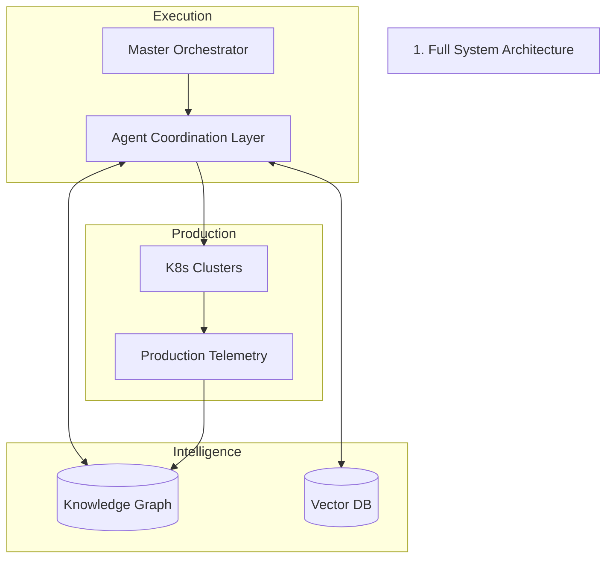
```mermaid
graph TD
    title[1. Full System Architecture]
    subgraph Execution
        Orchestrator[Master Orchestrator]
        Agents[Agent Coordination Layer]
    end
    subgraph Intelligence
        Graph[(Knowledge Graph)]
        Vector[(Vector DB)]
    end
    subgraph Production
        Telemetry[Production Telemetry]
        K8s[K8s Clusters]
    end
    Orchestrator --> Agents
    Agents <--> Graph
    Agents <--> Vector
    Telemetry --> Graph
    K8s --> Telemetry
    Agents --> K8s
```

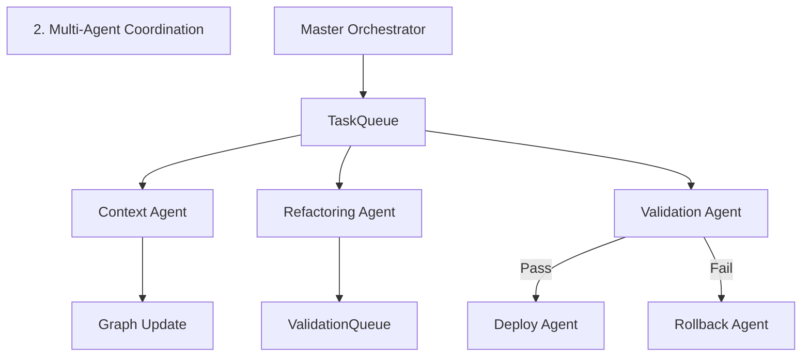
```mermaid
graph TD
    title[2. Multi-Agent Coordination]
    Master[Master Orchestrator] --> TaskQueue
    TaskQueue --> Context[Context Agent]
    TaskQueue --> Refactor[Refactoring Agent]
    TaskQueue --> Validate[Validation Agent]
    Context --> GraphUpdate[Graph Update]
    Refactor --> ValidationQueue
    Validate --> |Pass| Deploy[Deploy Agent]
    Validate --> |Fail| Rollback[Rollback Agent]
```

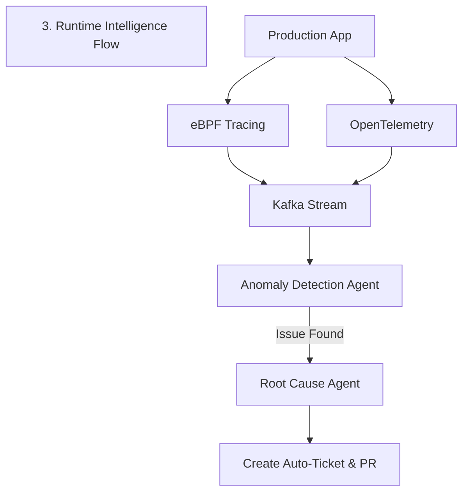
```mermaid
graph TD
    title[3. Runtime Intelligence Flow]
    App[Production App] --> eBPF[eBPF Tracing]
    App --> OTel[OpenTelemetry]
    eBPF --> Kafka[Kafka Stream]
    OTel --> Kafka
    Kafka --> Anomaly[Anomaly Detection Agent]
    Anomaly --> |Issue Found| RootCause[Root Cause Agent]
    RootCause --> Ticket[Create Auto-Ticket & PR]
```

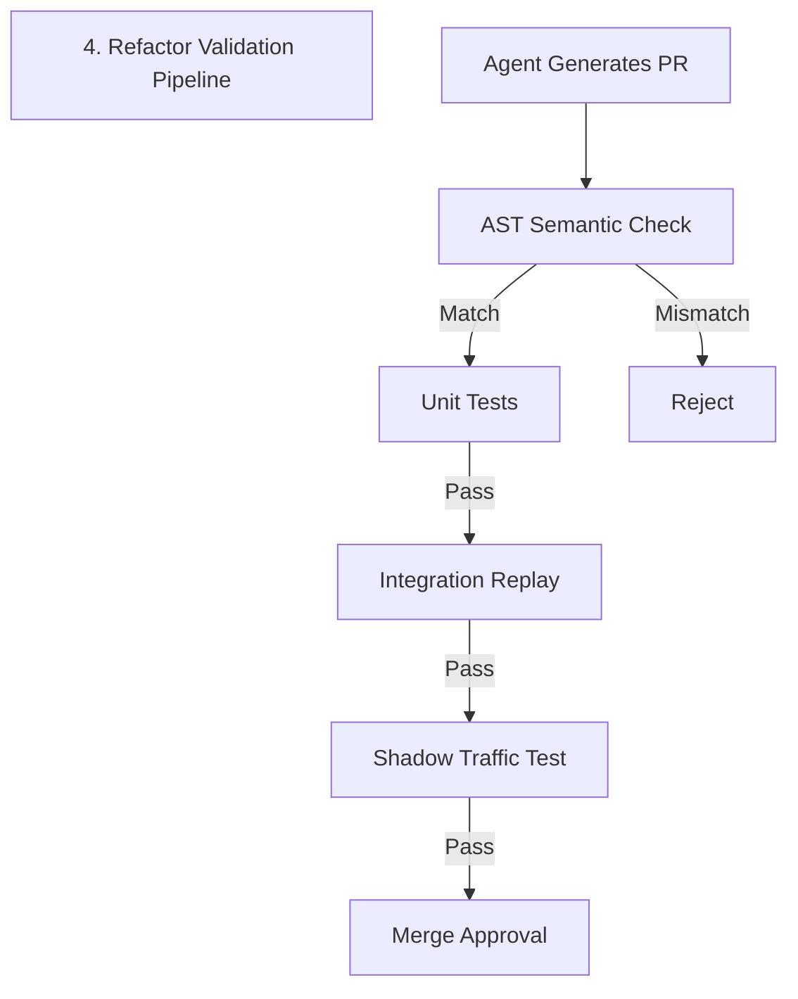
```mermaid
graph TD
    title[4. Refactor Validation Pipeline]
    PR[Agent Generates PR] --> AST[AST Semantic Check]
    AST --> |Match| Unit[Unit Tests]
    AST --> |Mismatch| Reject
    Unit --> |Pass| Integration[Integration Replay]
    Integration --> |Pass| Shadow[Shadow Traffic Test]
    Shadow --> |Pass| Approve[Merge Approval]
```

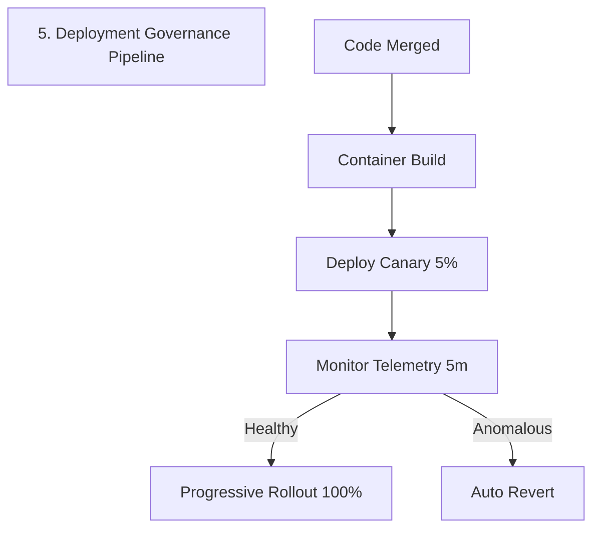
```mermaid
graph TD
    title[5. Deployment Governance Pipeline]
    Merge[Code Merged] --> Build[Container Build]
    Build --> Canary[Deploy Canary 5%]
    Canary --> Monitor[Monitor Telemetry 5m]
    Monitor --> |Healthy| Rollout[Progressive Rollout 100%]
    Monitor --> |Anomalous| Revert[Auto Revert]
```

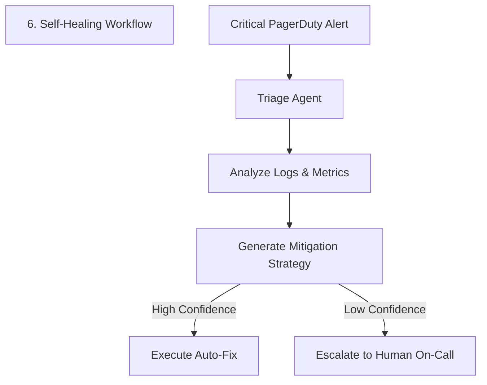
```mermaid
graph TD
    title[6. Self-Healing Workflow]
    Alert[Critical PagerDuty Alert] --> Tri[Triage Agent]
    Tri --> Logs[Analyze Logs & Metrics]
    Logs --> Fix[Generate Mitigation Strategy]
    Fix --> |High Confidence| AutoFix[Execute Auto-Fix]
    Fix --> |Low Confidence| Escalate[Escalate to Human On-Call]
```

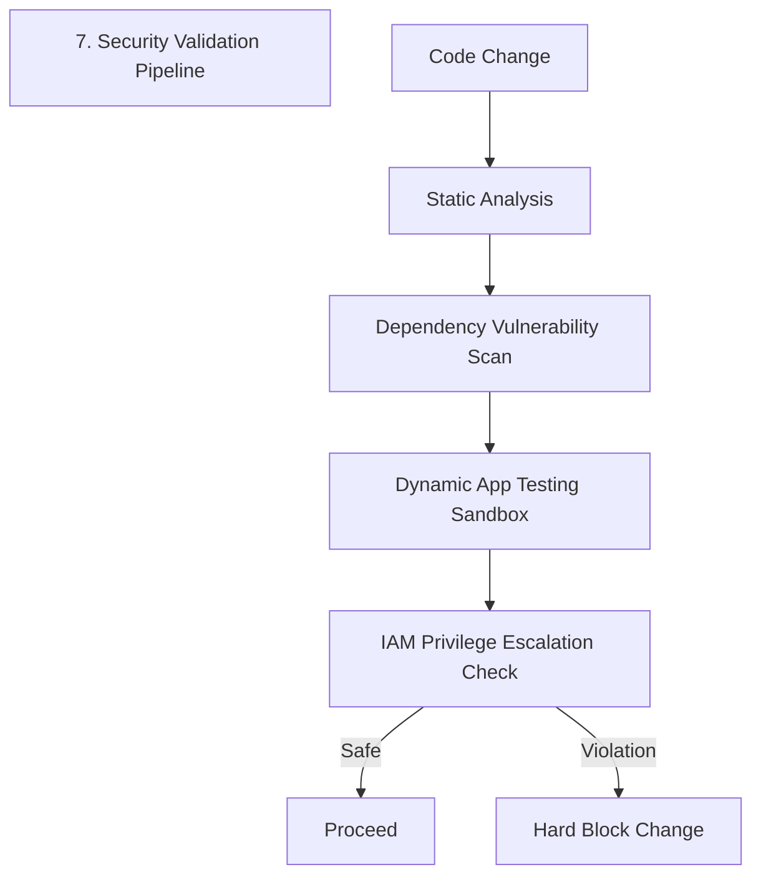
```mermaid
graph TD
    title[7. Security Validation Pipeline]
    Code[Code Change] --> SAST[Static Analysis]
    SAST --> DepCheck[Dependency Vulnerability Scan]
    DepCheck --> DAST[Dynamic App Testing Sandbox]
    DAST --> IAM[IAM Privilege Escalation Check]
    IAM --> |Safe| Proceed
    IAM --> |Violation| Block[Hard Block Change]
```

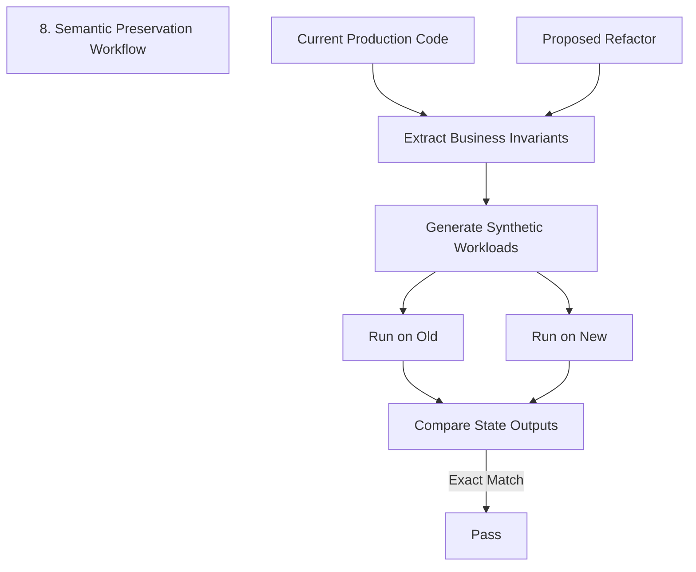
```mermaid
graph TD
    title[8. Semantic Preservation Workflow]
    OldCode[Current Production Code] --> Extract[Extract Business Invariants]
    NewCode[Proposed Refactor] --> Extract
    Extract --> Synth[Generate Synthetic Workloads]
    Synth --> RunOld[Run on Old]
    Synth --> RunNew[Run on New]
    RunOld --> Compare[Compare State Outputs]
    RunNew --> Compare
    Compare --> |Exact Match| Pass
```

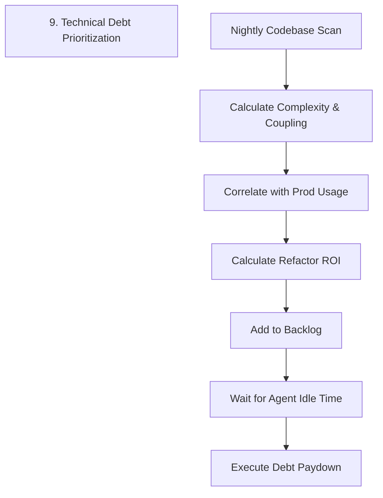
```mermaid
graph TD
    title[9. Technical Debt Prioritization]
    Scan[Nightly Codebase Scan] --> Metrics[Calculate Complexity & Coupling]
    Metrics --> Usage[Correlate with Prod Usage]
    Usage --> ROI[Calculate Refactor ROI]
    ROI --> Queue[Add to Backlog]
    Queue --> Idle[Wait for Agent Idle Time]
    Idle --> Refactor[Execute Debt Paydown]
```

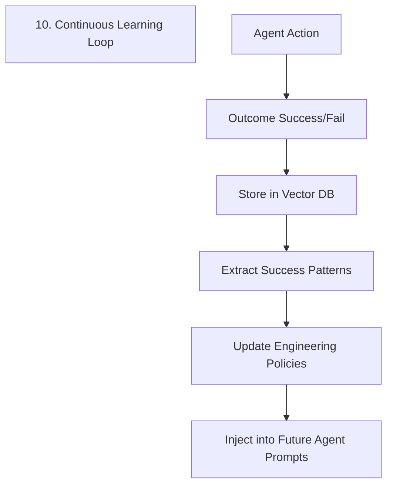
```mermaid
graph TD
    title[10. Continuous Learning Loop]
    Action[Agent Action] --> Result[Outcome Success/Fail]
    Result --> Store[Store in Vector DB]
    Store --> Pattern[Extract Success Patterns]
    Pattern --> Policy[Update Engineering Policies]
    Policy --> Prompts[Inject into Future Agent Prompts]
```

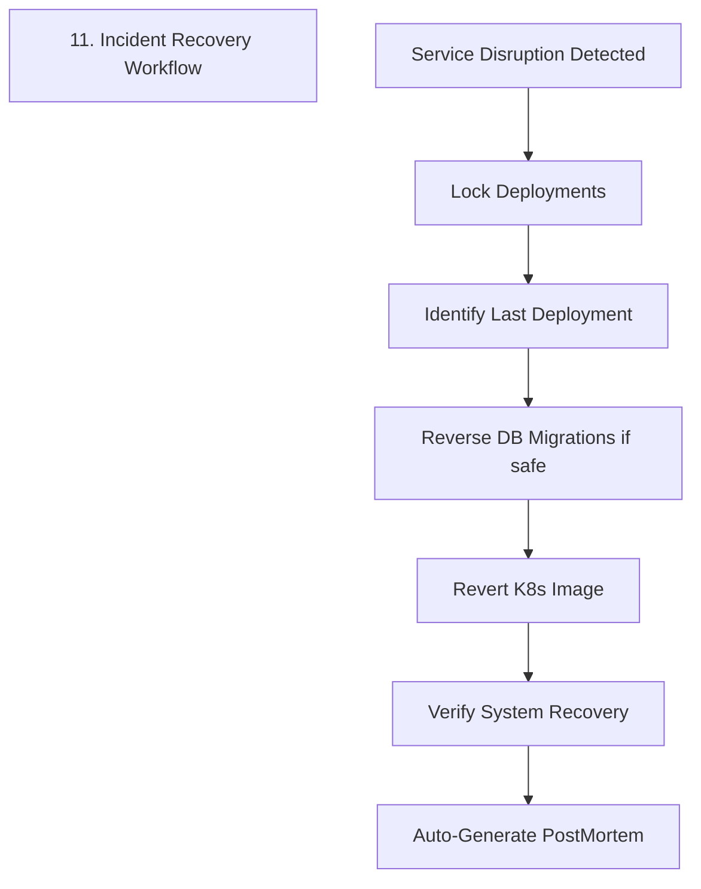
```mermaid
graph TD
    title[11. Incident Recovery Workflow]
    Downtime[Service Disruption Detected] --> Lock[Lock Deployments]
    Lock --> Identify[Identify Last Deployment]
    Identify --> RevertDB[Reverse DB Migrations if safe]
    RevertDB --> RevertCode[Revert K8s Image]
    RevertCode --> Verify[Verify System Recovery]
    Verify --> PostMortem[Auto-Generate PostMortem]
```

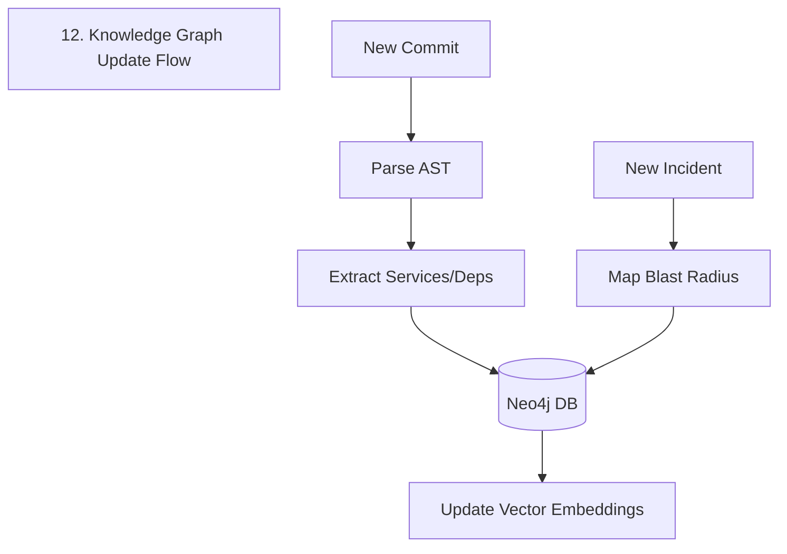
```mermaid
graph TD
    title[12. Knowledge Graph Update Flow]
    Commit[New Commit] --> Parse[Parse AST]
    Parse --> Entities[Extract Services/Deps]
    Entities --> Graph[(Neo4j DB)]
    Incident[New Incident] --> Impact[Map Blast Radius]
    Impact --> Graph
    Graph --> Embed[Update Vector Embeddings]
```

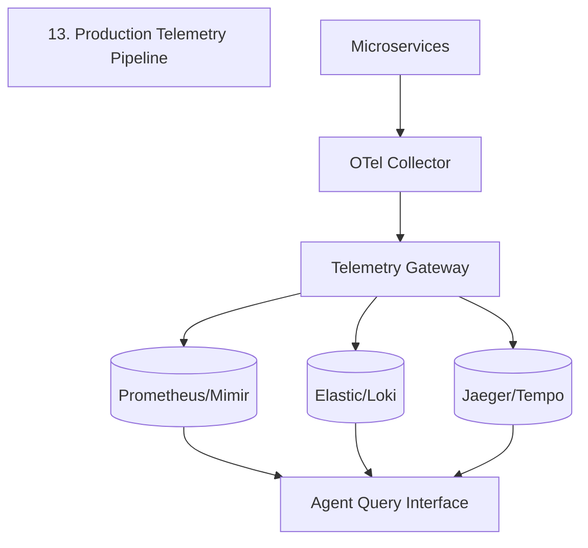
```mermaid
graph TD
    title[13. Production Telemetry Pipeline]
    Services[Microservices] --> Sidecar[OTel Collector]
    Sidecar --> Gateway[Telemetry Gateway]
    Gateway --> TSDB[(Prometheus/Mimir)]
    Gateway --> LogDB[(Elastic/Loki)]
    Gateway --> TraceDB[(Jaeger/Tempo)]
    TSDB & LogDB & TraceDB --> AIAgents[Agent Query Interface]
```

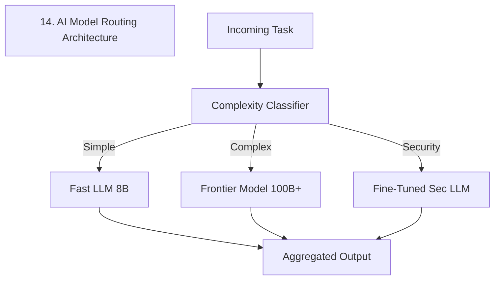
```mermaid
graph TD
    title[14. AI Model Routing Architecture]
    Task[Incoming Task] --> Classifier[Complexity Classifier]
    Classifier --> |Simple| SmallModel[Fast LLM 8B]
    Classifier --> |Complex| LargeModel[Frontier Model 100B+]
    Classifier --> |Security| SecModel[Fine-Tuned Sec LLM]
    SmallModel & LargeModel & SecModel --> Output[Aggregated Output]
```

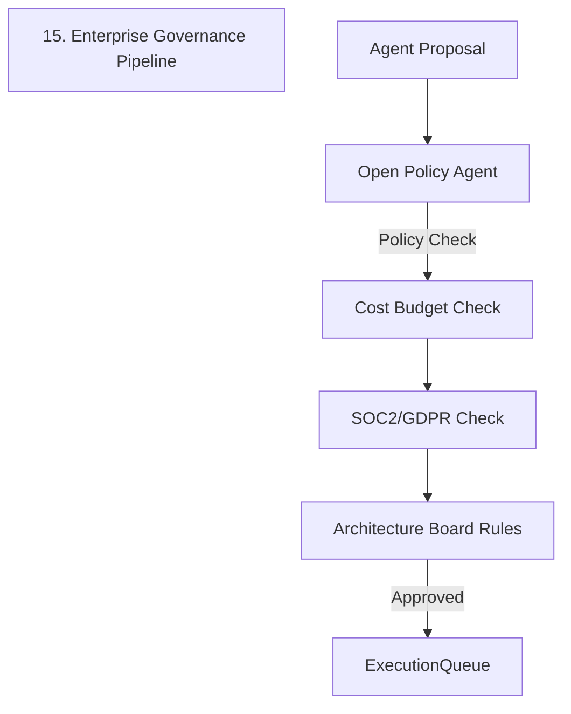
```mermaid
graph TD
    title[15. Enterprise Governance Pipeline]
    Proposal[Agent Proposal] --> OPA[Open Policy Agent]
    OPA --> |Policy Check| Budget[Cost Budget Check]
    Budget --> Compliance[SOC2/GDPR Check]
    Compliance --> Architect[Architecture Board Rules]
    Architect --> |Approved| ExecutionQueue
```

---

## 26. Technology Stack Recommendations
*   **Workflow Orchestration**: Temporal.io (for deterministic execution).
*   **Knowledge Graph**: Neo4j, LangChain Graph Cypher, Pinecone (Vectors).
*   **Agent Framework**: Custom Go/Rust event-driven microservices + specialized Python LLM runners.
*   **Validation Environment**: Firecracker MicroVMs for instant, secure sandboxing.
*   **Observability**: eBPF (Cilium/Tetragon), OpenTelemetry, Grafana Stack.
*   **CI/CD Integration**: ArgoCD, GitHub Actions.

## 27. Infrastructure Blueprint
A hub-and-spoke model. The **Control Plane** (The AI Brain) runs in a highly secure, isolated VPC. It accesses **Data Planes** (Tenant Environments) via strict cross-account IAM roles, assuming short-lived credentials only when a task is executing.

## 28. Cloud Architecture Design
Cloud-Agnostic but AWS-optimized. Uses EKS for scalable agent deployments, MSK (Managed Kafka) for the event bus, and Bedrock/Vertex for managed model access, ensuring data privacy and compliance.

## 29. Scaling Strategy
Agents are decoupled from models. Model inference is horizontally scaled using vLLM/TensorRT-LLM clusters. Agent workers autoscale based on SQS/Kafka lag. Graph traversal is optimized via read-replicas.

## 30. Long-Term Evolution Strategy
Phase 1: Human-in-the-loop (Co-pilot).
Phase 2: Human-on-the-loop (Approval gates for high-risk actions).
Phase 3: Fully Autonomous (The platform operates independently, humans define high-level OKRs).

## 31. Final Enterprise Architecture Summary
This platform represents a paradigm shift from **Writing Code** to **Governing Intent**. By combining deterministic enterprise systems (Temporal, eBPF, AST manipulation, Neo4j) with probabilistic AI models, we achieve a system that can understand, refactor, and operate massive production environments with mathematical safety guarantees and unparalleled scale. It acts as the ultimate Staff-level engineering collective, running 24/7.

---

## 32. Case Study: NG-VMS (First-Tier Sovereign Deployment)
The Next-Gen Visitor Management System (NG-VMS) serves as the primary instantiation of this blueprint's **Sovereign Concierge** and **Zero-Latency** principles.
- **Autonomous Biometrics**: Real-time GPU-accelerated face recognition and OCR as specified in the Agent Hierarchy.
- **AETHER Eyes**: Full implementation of the Runtime Intelligence Architecture using OpenTelemetry for kernel-level tracing.
- **Sovereign UI**: The VisionOS-inspired Glassmorphism interface (48px blur) demonstrates the platform's commitment to "God-Level" aesthetic standards.
- **Policy Engine**: A direct application of the Validation Governance Layer, enforcing state-machine invariants (Verhoeff Aadhaar Check, SHA-256 Blacklisting) at the kernel level.
- **Production Resilience**: Implementation of the **Sovereign Shutdown** protocol for zero-data-loss graceful termination.

